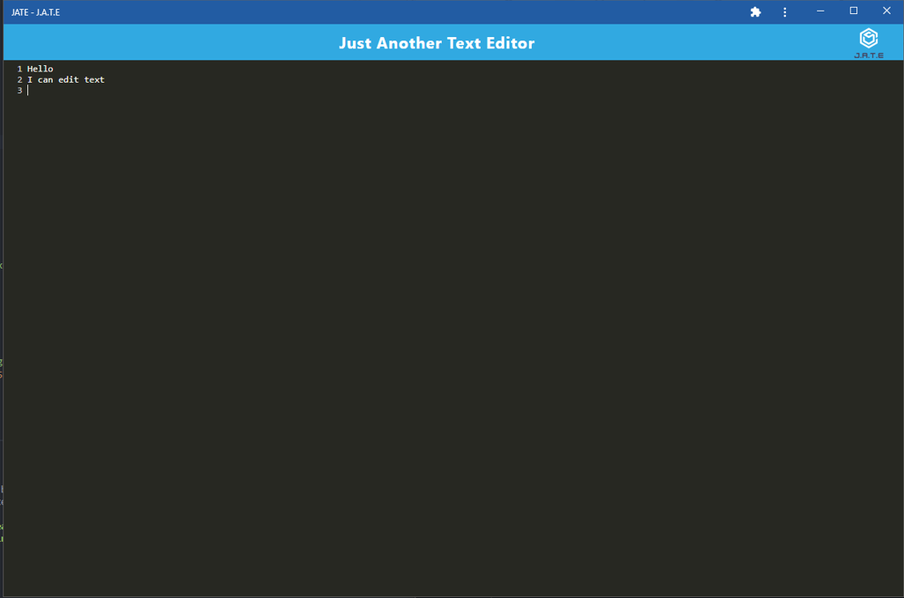

# PWA Text Editor

## Features
Text Editing: Create and edit text documents with a user-friendly interface.
Offline Access: The PWA works offline, allowing you to access and edit documents without an internet connection.
Responsive Design: The application is responsive and adapts to different screen sizes.

## Installation
To install and run the PWA Text Editor locally, follow these steps:

Clone the repository:
`git clone https://github.com/Justin-Connors/PWA-Text-Editor.git`
Navigate to the project directory:
`cd PWA-Text-Editor`  
Follow these steps:  
`npm run build`  
`npm start dev`  
`Navigate to http://localhost:8080` in your preferred browser.  
`install at the top, accept the prompt`

## Technologies Used
The PWA Text Editor is built using the following technologies:

HTML 
CSS 
JavaScript 
WebPack 
NodeJS 
Babel 

## License
The PWA Text Editor is released under the MIT License.

## Contact
If you have any questions or feedback, you can reach out to [Justin](mailto:justinconnors@hotmail.ca)